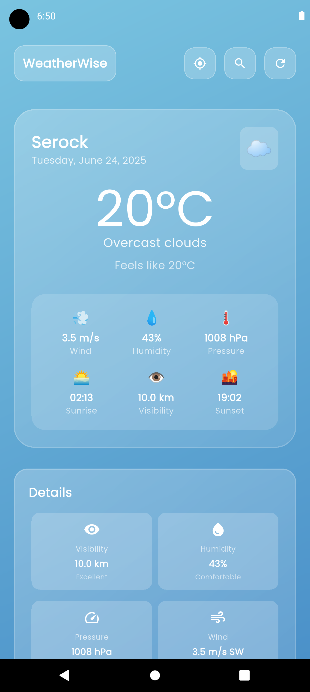
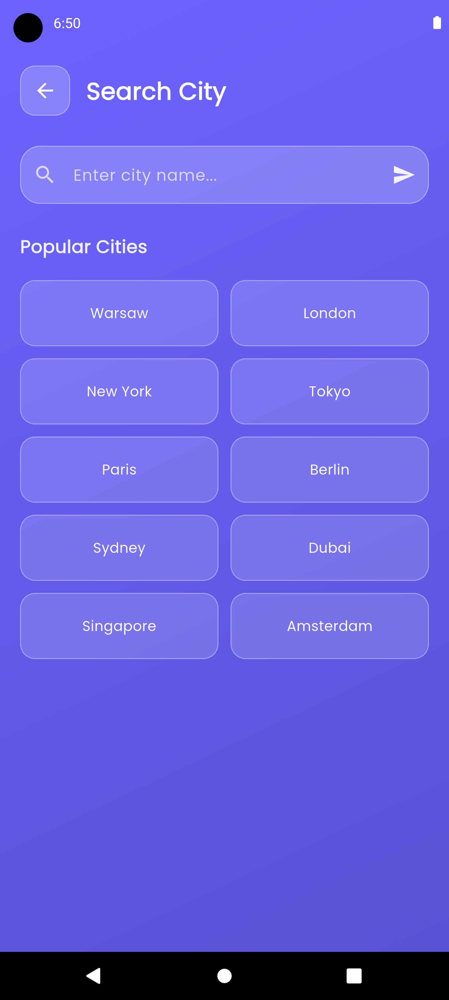
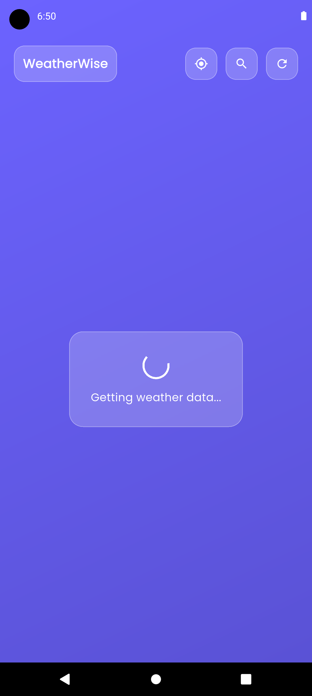

# WeatherWise 🌤️

Modern weather app with beautiful glassmorphism design and automatic location detection.

## Screenshots
<div align="center">
  
  
  
</div>


## Setup

1. **Clone and install**
```bash
git clone <your-repo-url>
cd weather_app
flutter pub get
```

2. **Get API key**
- Register at [OpenWeatherMap](https://openweathermap.org/api) (free)
- Copy your API key

3. **Add API key**
Create `lib/core/constants/api_keys.dart`:
```dart
class ApiKeys {
  static const String weatherApiKey = 'YOUR_API_KEY_HERE';
}
```

4. **Run**
```bash
flutter run
```

## Features

- 📍 **Auto location** - Gets weather for your current location
- 🔍 **City search** - Search any city worldwide  
- 🎨 **Modern UI** - Glassmorphism effects with dynamic gradients
- 💾 **Works offline** - Cached data when no internet
- 🔄 **Real-time** - Fresh weather data

## Permissions

**Android** - Add to `android/app/src/main/AndroidManifest.xml`:
```xml
<uses-permission android:name="android.permission.ACCESS_FINE_LOCATION" />
<uses-permission android:name="android.permission.ACCESS_COARSE_LOCATION" />
```

**iOS** - Add to `ios/Runner/Info.plist`:
```xml
<key>NSLocationWhenInUseUsageDescription</key>
<string>This app needs location access to show weather for your current location</string>
```

## Security

Never commit `api_keys.dart` to git - it's already in `.gitignore`

## Author

Created by **Adrianna 'Aduzja' Gerek** 👩‍💻

---

Built with Flutter 💙
